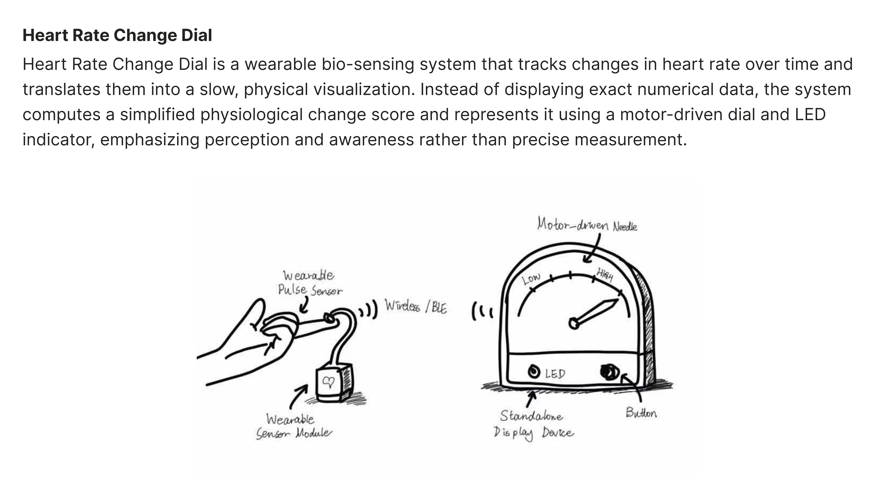
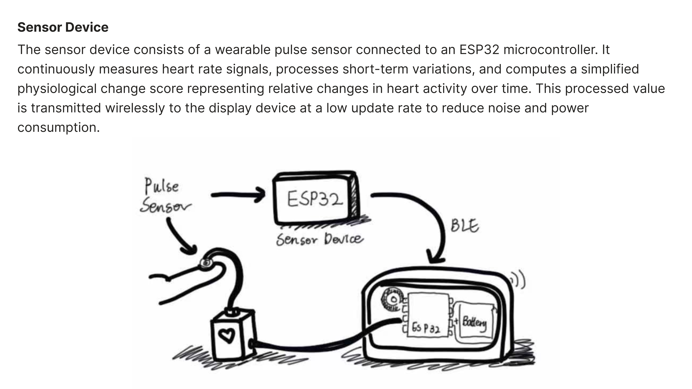
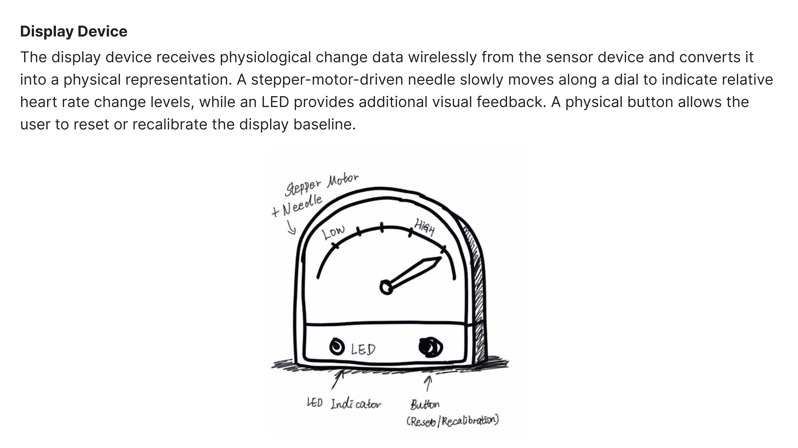
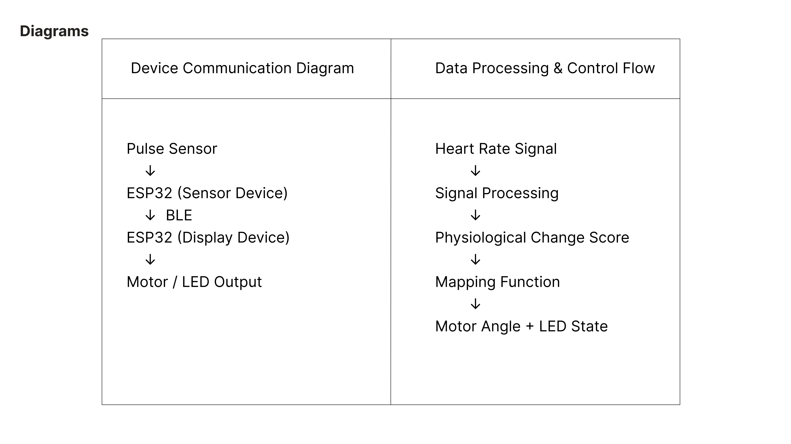

# Heart Rate Change Dial

A wearable bio-sensing system that tracks **changes** in heart rate over time and translates them into a **slow, physical visualization**.  
Instead of showing exact BPM numbers, it computes a simplified **physiological change score** and represents it using a motor-driven dial + LED.

---

## 1) Overview (What it is + general sketch)
**What it does (1–3 sentences):**  
Heart Rate Change Dial uses a wearable pulse sensor to detect heart activity and computes a simplified change score that represents relative changes over time.  
That score is sent wirelessly to a standalone display device, where a motor-driven needle and an LED provide an ambient visualization of change.

**General sketch (highlight physical features):**  

---

## 2) Sensor Device (detailed sketch + how it works)
**Device description:**  
The sensor device consists of a wearable pulse sensor connected to an ESP32 microcontroller. It continuously measures heart rate signals, processes short-term variations, and computes a simplified physiological change score representing relative changes in heart activity over time. This processed value is transmitted wirelessly to the display device at a low update rate to reduce noise and power consumption.

**Sensor device sketch:**  

---

## 3) Display Device (detailed sketch + how it works)
**Device description:**  
The display device receives physiological change data wirelessly from the sensor device and converts it into a physical representation. A stepper-motor-driven needle slowly moves along a dial to indicate relative heart rate change levels, while an LED provides additional visual feedback. A physical button allows the user to reset or recalibrate the display baseline.

**Display device sketch:**  

---

## 4) Diagrams (communication + detailed control/data flow)
This section contains (1) a device communication diagram and (2) a data processing & control flow diagram.

---

## Parts List (with part numbers)

### 🔹 Sensor Device (Wearable Sensor Module)

#### Microcontroller
- **Name:** Seeed Studio XIAO ESP32C3  
- **Part Number:** 113991054  
- **Reason:** Ultra-compact ESP32 board with BLE support, suitable for wearable sensing  
- **Datasheet:** `Seeed_XIAO_ESP32C3_Datasheet.pdf`

#### Heart Rate / Pulse Sensor
- **Name:** Pulse Sensor Amped  
- **Part Number:** SEN-11574  
- **Type:** Optical PPG heart rate sensor  
- **Reason:** Designed for Arduino/ESP32 projects, widely used in education and prototyping  
- **Datasheet:** `Pulse_Sensor_Amped_SEN-11574_Datasheet.pdf`

#### Power Source
- **Name:** USB Power / LiPo Battery (3.7V)  
- **Part Number:** N/A (Generic Power Source)  
- **Reason:** Powering the wearable sensor module during prototyping  
- **Datasheet:** `Generic_LiPo_Battery_Datasheet.pdf` 

---

### 🔹 Display Device (Standalone Physical Dial Display)

#### Microcontroller
- **Name:** Seeed Studio XIAO ESP32C3  
- **Part Number:** 113991054  
- **Reason:** Used as a standalone BLE receiver and motor controller  
- **Datasheet:** `Seeed_XIAO_ESP32C3_Datasheet.pdf`  

#### Stepper Motor (Dial Needle)
- **Name:** 28BYJ-48 Stepper Motor (5V)  
- **Part Number:** 28BYJ-48  
- **Reason:** Low-cost stepper motor commonly used for analog dial indicators  
- **Datasheet:** `28BYJ-48_Stepper_Motor_Datasheet.pdf`

#### Stepper Motor Driver
- **Name:** ULN2003 Stepper Motor Driver Board  
- **Part Number:** ULN2003A  
- **Reason:** Required to drive the 28BYJ-48 motor from ESP32 GPIO pins  
- **Datasheet:** `ULN2003A_Datasheet.pdf`

#### LED Indicator
- **Name:** 5mm LED (Red)  
- **Part Number:** Generic 5mm LED  
- **Electrical Specifications:**  
  - Forward Voltage: ~2.0V  
  - Forward Current: 20mA  
- **Datasheet:** `Generic_5mm_LED_Datasheet.pdf`

#### Push Button
- **Name:** Momentary Push Button Switch (Normally Open)  
- **Part Number:** Generic Tactile Switch  
- **Reason:** Used for reset and recalibration interaction  
- **Datasheet:** `Momentary_Push_Button_Datasheet.pdf`

### Sensor device
- Pulse Sensor (PPG heart rate sensor): **Pulse Sensor Amped – SEN-11574** (or your exact model)
- Microcontroller board: **ESP32 board** (put the exact board part number/model you will use, e.g., “Seeed Studio XIAO ESP32C3 – 113991054” if that’s what you have)
- Power: (choose one) LiPo battery model / USB power bank (write the exact battery model if you know it)

### Display device
- Microcontroller board: **ESP32 board** (same as above, list exact model)
- Stepper motor (dial needle): **28BYJ-48 5V stepper motor** (common part name)
- Stepper driver: **ULN2003 driver board**
- LED indicator: **5mm LED** (spec: color, forward voltage, current)  
- Push button: **momentary push button switch** (spec: normally-open)

---

## Datasheets
All datasheets are stored in the `/datasheets` folder as individual PDF files (one PDF per device/part).
